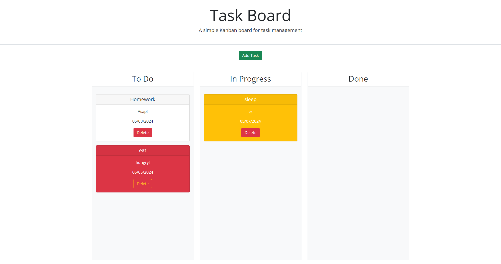

# Task-Board

## Description

- A task board that uses local storage to keep track of your tasks!

## Usage

- Enter your information and content of your task for a card to be created dynamically.

- You can move around the cards to keep track of their progress.

- depending on the date, the color of card will change! 

Launched webstie link: https://crissal2.github.io/Task-Board/

